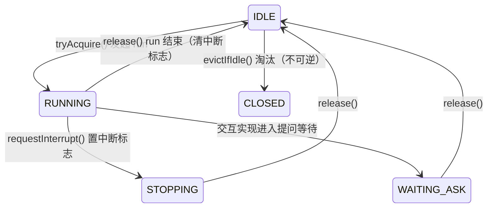

# agent-engine

Agent 引擎内核：主循环、钩子链、会话执行态、上下文窗口与端口装配。

- **Java 17**，编译用 `--release 17`（见 [pom.xml](pom.xml)）
- **零依赖内核**：唯一外部依赖是 `slf4j-api`（日志门面），不解析 JSON、不绑定任何 LLM SDK
- **引擎不自带任何端口实现**：模型、工具、存储、交互全部经端口注入，装配关系一眼可见

## 目录

- [架构总览](#架构总览)
- [核心链路](#核心链路)
  - [1. 装配链路](#1-装配链路)
  - [2. run 链路（发起一次运行）](#2-run-链路发起一次运行)
  - [3. 回合循环（引擎唯一的 while）](#3-回合循环引擎唯一的-while)
  - [4. 钩子链](#4-钩子链)
  - [5. 工具执行链](#5-工具执行链)
  - [6. 事件链](#6-事件链)
  - [7. 持久化与恢复链](#7-持久化与恢复链)
  - [8. 会话状态机](#8-会话状态机)
  - [9. 上下文窗口与配对修复](#9-上下文窗口与配对修复)
- [端口一览](#端口一览)
- [事件一览](#事件一览)
- [配置参数](#配置参数)
- [使用示例](#使用示例)
- [设计约定与职责边界](#设计约定与职责边界)

## 架构总览

```
cn.kong.engine
├── AgentEngine / EngineConfig / EngineException     门面、配置、异常
├── loop/        TurnLoop 主循环、TurnContext 轮次上下文、RunResult
├── hook/        Hook 四阶段钩子 + HookChain 聚合执行
├── scope/       会话执行态：SessionManager / Session / RunHandle / TodoBoard…
├── window/      ContextWindow 块结构窗口、Block、BlockKind
├── msg/         引擎自有消息模型：ChatMsg / ToolCall / ToolResult / ToolSpec…
├── event/       EngineEvent（密封事件 17 种）、EventPublisher、EventSink
├── stop/        StopCategory 终止分类
└── port/        全部端口（引擎对外的全部认知边界）
    ├── model/        LlmPort / LlmRequest / LlmReply / StreamCallbacks
    ├── tool/         ToolSet / Tool / ToolContext
    ├── context/      ContextAssembler / TokenEstimator / EnvironmentProbe / ContextMetrics
    ├── interaction/  InteractionChannel（提问 + 破坏性门禁）
    ├── store/        LedgerPort / SnapshotPort / ArtifactPort / MemoryPort / Workspace
    └── compression/  CompressionPolicy / CompressionLevel / CompressionState / SummarizerPort
```

一句话心智模型：

> [AgentEngine](src/main/java/cn/kong/engine/AgentEngine.java) 是门面，[TurnLoop](src/main/java/cn/kong/engine/loop/TurnLoop.java) 是唯一主循环，
> [Session](src/main/java/cn/kong/engine/scope/Session.java) 以 CAS 保证同会话至多一个 RUNNING，
> 持久化 = [LedgerPort](src/main/java/cn/kong/engine/port/store/LedgerPort.java) 账本重放 + [SnapshotPort](src/main/java/cn/kong/engine/port/store/SnapshotPort.java) 快照恢复，
> 一切可观测性经 [EngineEvent](src/main/java/cn/kong/engine/event/EngineEvent.java) 事件流出口。

## 核心链路

### 1. 装配链路

入口：[AgentEngine.builder()](src/main/java/cn/kong/engine/AgentEngine.java) → `Builder` 显式注入全部端口 → `build()` 校验完整性（缺任何端口抛 [EngineException](src/main/java/cn/kong/engine/EngineException.java)）。

Builder 注入的 11 个端口：

| 端口 | 语义 |
|---|---|
| `llm` | [LlmPort](src/main/java/cn/kong/engine/port/model/LlmPort.java)：模型对话（流式 + 同步补全） |
| `tools` | [ToolSet](src/main/java/cn/kong/engine/port/tool/ToolSet.java)：工具集合聚合入口 |
| `assembler` | [ContextAssembler](src/main/java/cn/kong/engine/port/context/ContextAssembler.java)：上下文组装布局策略 |
| `estimator` | [TokenEstimator](src/main/java/cn/kong/engine/port/context/TokenEstimator.java)：token 估算 |
| `memory` | [MemoryPort](src/main/java/cn/kong/engine/port/store/MemoryPort.java)：跨会话记忆 |
| `environment` | [EnvironmentProbe](src/main/java/cn/kong/engine/port/context/EnvironmentProbe.java)：每轮环境探针 |
| `ledger` | [LedgerPort](src/main/java/cn/kong/engine/port/store/LedgerPort.java)：只追加消息账本 |
| `snapshots` | [SnapshotPort](src/main/java/cn/kong/engine/port/store/SnapshotPort.java)：终态快照 |
| `artifacts` | [ArtifactPort](src/main/java/cn/kong/engine/port/store/ArtifactPort.java)：超大工具结果落盘/读回 |
| `interaction` | [InteractionChannel](src/main/java/cn/kong/engine/port/interaction/InteractionChannel.java)：提问 + 破坏性门禁 |
| `workspace` | [Workspace](src/main/java/cn/kong/engine/port/store/Workspace.java)：会话目录读写沙箱 |

另注入 [EngineConfig](src/main/java/cn/kong/engine/EngineConfig.java)（不可变，见[配置参数](#配置参数)）与任意数量 [Hook](src/main/java/cn/kong/engine/hook/Hook.java)。

构造期完成三件事（`AgentEngine` 私有构造器）：

1. 创建两个线程池：`engine-run`（cached，跑 run）与 `engine-tool`（fixed，大小 = `toolParallelism`）
2. 创建 [SessionManager](src/main/java/cn/kong/engine/scope/SessionManager.java)（会话缓存 + 重建）
3. 把 11 个端口聚合为 [TurnLoop.Deps](src/main/java/cn/kong/engine/loop/TurnLoop.java) record 注入主循环

### 2. run 链路（发起一次运行）

入口：[AgentEngine.run(sessionId, userInput)](src/main/java/cn/kong/engine/AgentEngine.java)

```
AgentEngine.run
  ├─ SessionManager.acquire      缓存命中或从持久层重建（load：账本重放建窗口 + 快照恢复状态/待办）
  ├─ Session.tryAcquire          CAS IDLE→RUNNING；失败 → 返回已完成的 REJECTED_BUSY 句柄
  ├─ 发布 RunStarted / SessionStatusChanged(RUNNING)
  ├─ runPool.submit ────────────► TurnLoop.run(session, userInput)
  │                                  （finally：release 回 IDLE + 发 SessionStatusChanged(IDLE)）
  └─ 返回 RunHandle（await 可选带超时，见 RunHandle）
```

要点：

- **互斥在内核**：并发正确性由 CAS 状态机保证，不依赖外部模块自觉；忙时策略为固定拒绝（`StopCategory.REJECTED_BUSY`）
- **恢复语义**：`acquire` 重建的会话与全新会话走同一条 `run` 路径，`RunStarted.resumed` 标记是否续会话
- [RunHandle](src/main/java/cn/kong/engine/scope/RunHandle.java) 对被拒绝的 run 也返回已完成句柄，调用方统一处理

### 3. 回合循环（引擎唯一的 while）

核心文件：[TurnLoop.run](src/main/java/cn/kong/engine/loop/TurnLoop.java)。每轮流水线：

```
用户输入：事件 UserMessage → 账本 append → 窗口 addUser
                       │
        ┌──────────────▼──────────────────────────────────────────┐
        │ ① 检查点：中断标志 / 步数上限（maxTurns）                    │
        │ ② PreModel 钩子（预算/压缩）        Stop 则收尾            │
        │ ③ 组装：内核收集零件 → assembler.assemble 布局             │
        │ ④ 模型：LlmPort.chat 流式回调 → 事件增量转发                │
        │    LlmReply → 累计用量/事件/账本/窗口                       │
        │ ⑤ PostModel 钩子（循环/无进展检测）  Stop 则收尾            │
        │ ⑥ 模型不再要工具？→ COMPLETED 收尾（截断则续写）            │
        │ ⑦ PreTool 钩子（门禁）              Stop 则收尾            │
        │ ⑧ 并行执行工具（超时/门禁/异常全部转 failure 结果）          │
        │ ⑨ PostTool 钩子（熔断计数/快照，纯观察）                    │
        │ ⑩ 溢出关卡：超大结果落 ArtifactPort，窗口只留头尾+引用       │
        │    工具结果逐条回填：账本 append → 窗口 addToolResult       │
        └──────────────┬──────────────────────────────────────────┘
                       └──► 下一轮，直到终止条件触发 finish()
```

`finish()` 统一收尾（所有终止路径共用）：发 `RunFinished` 事件 → 保存 [SessionSnapshot](src/main/java/cn/kong/engine/port/store/SnapshotPort.java)（待办/累计用量/压缩状态/轮次）。终止分类见 [StopCategory](src/main/java/cn/kong/engine/stop/StopCategory.java)：COMPLETED / MAX_TURNS / BUDGET_EXCEEDED / LOOP_DETECTED / NO_PROGRESS / GATE_REJECTED / INTERRUPTED / INTERNAL_ERROR / REJECTED_BUSY。

组装零件（`TurnLoop.parts()`，收集归内核、布局归策略）：

| 零件 | 来源 | 说明 |
|---|---|---|
| systemPrompt | EngineConfig | 系统提示词 |
| memories | [MemoryPort.render](src/main/java/cn/kong/engine/port/store/MemoryPort.java) | 跨会话记忆，渲染失败降级为 null 不阻断循环 |
| summary | SessionState.compression | 上次压缩摘要（无则 null） |
| environment | [EnvironmentProbe.probe](src/main/java/cn/kong/engine/port/context/EnvironmentProbe.java) | 工作目录/时间等，同样降级容错 |
| todo | [TodoBoard.render](src/main/java/cn/kong/engine/scope/TodoBoard.java) | 会话待办列表 |
| nudges | [TurnContext.nudges](src/main/java/cn/kong/engine/loop/TurnContext.java) | 钩子注入的温和提醒，组装后即消费清空 |
| window | [ContextWindow](src/main/java/cn/kong/engine/window/ContextWindow.java) | 会话历史（模型消息序列由它产出） |

**输出截断续写**：`LlmReply.truncated()`（finishReason=length）时循环不退出，注入续写提醒进入下一轮——续写计入轮次，受 maxTurns 约束。

**中断检查点**：轮首 / PreModel 钩子后组装前 / PreTool 钩子后工具执行前。标记式软中断，当前检查点后优雅停止，不做抢占。

### 4. 钩子链

钩子是横切能力（预算/压缩/门禁/熔断）的统一挂载形式：实现 [Hook](src/main/java/cn/kong/engine/hook/Hook.java) 标记接口（`order()` 小者先，默认 100），按需实现四个阶段：

| 阶段 | 接口 | 时机 | 典型用途 |
|---|---|---|---|
| PreModel | [PreModelHook](src/main/java/cn/kong/engine/hook/PreModelHook.java) | 模型调用前 | 预算检查、上下文压缩 |
| PostModel | [PostModelHook](src/main/java/cn/kong/engine/hook/PostModelHook.java) | 模型回复后 | 循环检测、无进展检测 |
| PreTool | [PreToolHook](src/main/java/cn/kong/engine/hook/PreToolHook.java) | 工具执行前 | 门禁审批 |
| PostTool | [PostToolHook](src/main/java/cn/kong/engine/hook/PostToolHook.java) | 工具执行后 | 熔断计数、快照落盘（纯观察，不能终止） |

结论模型（[HookResult](src/main/java/cn/kong/engine/hook/HookResult.java)，密封类型）：

- `Ok`：放行
- `Nudge(message)`：温和提醒，注入下一轮组装（不终止）
- `Stop(category, message)`：立即终止本次 run

聚合规则（[HookChain](src/main/java/cn/kong/engine/hook/HookChain.java)）：Nudge 累积；首个 Stop 生效，其后钩子不再执行；每个 Nudge/Stop 都发布 `GuardTriggered` 事件——治理行为天然可观测。钩子经 [TurnContext](src/main/java/cn/kong/engine/loop/TurnContext.java) 读写运行态（`reply` 在模型返回后可读，`nudges` 写入后下轮生效）。

### 5. 工具执行链

入口：`TurnLoop.executeTools`（并行）→ `executeWithGate`（门禁）→ [ToolSet.execute](src/main/java/cn/kong/engine/port/tool/ToolSet.java)（统一入口）。

- **并行**：全部调用提交 `engine-tool` 固定线程池（大小 = `toolParallelism`），逐个 `future.get(toolTimeout)`
- **超时**：每个工具独立享有 `toolTimeout` 上限（默认 30 秒）；超时转 failure 结果并 `cancel(true)`，**不中断循环**
- **门禁**：工具 `spec.destructive=true` 且未开 `autoApproveDestructive` 时，走 [InteractionChannel.gate](src/main/java/cn/kong/engine/port/interaction/InteractionChannel.java) 审批；REJECTED → failure 结果回填模型
- **异常隔离**：未知工具、实现抛异常都由 `ToolSet.execute` 默认方法转为 failure 结果——**失败不等于中断**，由模型决定下一步；只有钩子能终止循环
- **执行上下文**：[ToolContext](src/main/java/cn/kong/engine/port/tool/ToolContext.java) 注入会话 ID、轮次、工作区、工件端口、交互通道、待办板、事件总线
- **参数零解析**：[ToolCall.argumentsJson](src/main/java/cn/kong/engine/msg/ToolCall.java) 以原始 JSON 字符串传给工具，内核不解析 JSON

**溢出关卡**（`TurnLoop.spillIfHuge`）：工具结果超过 `spillThresholdChars` 时全文落 [ArtifactPort](src/main/java/cn/kong/engine/port/store/ArtifactPort.java)，窗口与账本只保留头尾 + 引用（`artifact:refId`，可按行读回）——上下文不被大结果淹没。

工具结果分两路回填：`output`（模型可见正文）与 `toolView`（UI 结构化视图，引擎按不透明值透传），见 [ToolResult](src/main/java/cn/kong/engine/msg/ToolResult.java)。

**人机提问**：工具经 `ToolContext.interaction().ask()` 阻塞等待答案；异步通道由外部调用 `AgentEngine.answer()` → `deliverAnswer()` 唤醒（同步通道返回 false）。

### 6. 事件链

[EngineEvent](src/main/java/cn/kong/engine/event/EngineEvent.java) 是密封接口（17 种事件，见[事件一览](#事件一览)），由 [EventPublisher](src/main/java/cn/kong/engine/event/EventPublisher.java) **同步、按发生顺序**派发给全部 [EventSink](src/main/java/cn/kong/engine/event/EventSink.java)：

- 订阅/退订：`AgentEngine.subscribe(sink)` / `unsubscribe(sink)`
- 传输层（SSE/WebSocket/日志/回放）从事件流接线，引擎与传输完全解耦
- 订阅者异常被隔离（记日志不中断循环）——可观测性不能反噬执行

### 7. 持久化与恢复链

持久化 = 账本（事实源） + 快照（终态缓存）：

| 通道 | 端口 | 内容 | 写入时机 |
|---|---|---|---|
| 账本 | [LedgerPort](src/main/java/cn/kong/engine/port/store/LedgerPort.java) | 全部会话消息（USER/ASSISTANT/TOOL，按会话隔离、seq 递增） | 每条消息产生即 append |
| 快照 | [SnapshotPort](src/main/java/cn/kong/engine/port/store/SnapshotPort.java) | 待办、累计用量、压缩状态、轮次 | 每次 run 收尾 `finish()` |
| 工件 | [ArtifactPort](src/main/java/cn/kong/engine/port/store/ArtifactPort.java) | 超大工具结果全文 | 溢出关卡触发时 |

**恢复**（[SessionManager.load](src/main/java/cn/kong/engine/scope/SessionManager.java)）：

```
ledger.replay(sessionId, 1)  → 逐条 window.addFromMessage 重建窗口
snapshots.load(sessionId)    → 恢复 SessionState（轮次/用量/压缩态）+ TodoBoard
```

**淘汰**（`SessionManager.evict`，由 `AgentEngine.evict` 暴露）：仅清内存缓存、不动磁盘；空闲（IDLE）才能淘汰，运行中拒绝；条件移除（`cache.remove(key, instance)`）避免与并发 `acquire` 装载的新实例冲突。淘汰后再次 `acquire` 将从持久层完整重建。

### 8. 会话状态机

[SessionStatus](src/main/java/cn/kong/engine/scope/SessionStatus.java) 与 [Session](src/main/java/cn/kong/engine/scope/Session.java)（全部 CAS 迁移）：



- **CLOSED 是淘汰终态**：仅可从 IDLE 迁入；淘汰成功则该实例永不再运行（与 `tryAcquire` 在同一状态位互斥）
- **中断 = 标记 + 状态迁移**：`requestInterrupt` CAS RUNNING→STOPPING 并置 `volatile` 标志，循环在检查点观察标志优雅停止
- WAITING_ASK 保留给交互通道实现使用（如 ask 阻塞期间），内核不主动迁移
- 会话累计状态（轮次/总用量/压缩态）在 [SessionState](src/main/java/cn/kong/engine/scope/SessionState.java)，`synchronized` 防护，随快照持久化

### 9. 上下文窗口与配对修复

[ContextWindow](src/main/java/cn/kong/engine/window/ContextWindow.java) 是会话历史的内存结构，按 [Block](src/main/java/cn/kong/engine/window/Block.java)（USER / ASSISTANT / TOOL_RESULT，[BlockKind](src/main/java/cn/kong/engine/window/BlockKind.java)）组织。

核心不变量（**配对完整性**）：每个 `assistant.toolCall` 必有配对的 TOOL_RESULT 块。`toMessages()` 出口做配对修复：

1. 有调用无结果 → 补合成结果 `[工具执行结果缺失]`（模型协议要求每个 tool_call 必须有配对 tool 消息）
2. 有结果无调用 → 孤儿结果丢弃

窗口只存对话；系统/记忆/环境等头尾注入段每轮由组装器现拼，不进窗口。

压缩操作集（由压缩策略/钩子调用，普通轮次不触碰）：

- `snipOldToolResults`：SNIP 档，截断旧工具结果文本（保留头尾），尾部保护块不动
- `clearBefore`：PRUNE/SUMMARIZE 档，仅保留最近 N 块，更早历史整体移除（孤儿块由配对修复兜底）
- `metrics`：token 用量与块分布快照，供 [CompressionPolicy](src/main/java/cn/kong/engine/port/compression/CompressionPolicy.java) 决策

压缩档位 [CompressionLevel](src/main/java/cn/kong/engine/port/compression/CompressionLevel.java)：NONE / SNIP / PRUNE / SUMMARIZE（摘要由 [SummarizerPort](src/main/java/cn/kong/engine/port/compression/SummarizerPort.java) 产出，压缩状态 [CompressionState](src/main/java/cn/kong/engine/port/compression/CompressionState.java) 随快照持久化）。尾部保护块数 `tailGuardBlocks` 保证最近上下文不被压缩触碰。

## 端口一览

| 包 | 端口 | 引擎对它的全部认知 |
|---|---|---|
| [port/model](src/main/java/cn/kong/engine/port/model/LlmPort.java) | `LlmPort` | `chat()` 同步阻塞、按序触发 [StreamCallbacks](src/main/java/cn/kong/engine/port/model/StreamCallbacks.java)，终点 onDone/onError；重试在适配器内部；`complete()` 供摘要器等内部用途 |
| [port/tool](src/main/java/cn/kong/engine/port/tool/ToolSet.java) | `ToolSet` | `specs()` 暴露工具规格；`execute()` 统一入口，查不到/抛异常转 failure |
| [port/context](src/main/java/cn/kong/engine/port/context/ContextAssembler.java) | `ContextAssembler` | 拿零件定布局；零件收集归内核 |
| [port/context](src/main/java/cn/kong/engine/port/context/TokenEstimator.java) | `TokenEstimator` | 粗估即可用于水位判断 |
| [port/context](src/main/java/cn/kong/engine/port/context/EnvironmentProbe.java) | `EnvironmentProbe` | 每轮探测，null 表示无 |
| [port/interaction](src/main/java/cn/kong/engine/port/interaction/InteractionChannel.java) | `InteractionChannel` | `ask()` 工具线程阻塞等答案；`gate()` 破坏性审批；`deliverAnswer()` 异步投递 |
| [port/store](src/main/java/cn/kong/engine/port/store/LedgerPort.java) | `LedgerPort` | 只追加、按会话隔离、seq 递增、可从任意 seq 重放 |
| [port/store](src/main/java/cn/kong/engine/port/store/SnapshotPort.java) | `SnapshotPort` | 会话级终态快照保存/恢复 |
| [port/store](src/main/java/cn/kong/engine/port/store/ArtifactPort.java) | `ArtifactPort` | 超大结果落盘（refId 跨重放稳定）与按行读回 |
| [port/store](src/main/java/cn/kong/engine/port/store/MemoryPort.java) | `MemoryPort` | 渲染进上下文头部；`update_memory` 工具写入 |
| [port/store](src/main/java/cn/kong/engine/port/store/Workspace.java) | `Workspace` | 读写分区沙箱：`resolve` 限读区（会话目录），`resolveWritable` 限写区（可写子区），`relativize` 统一回传路径口径 |
| [port/compression](src/main/java/cn/kong/engine/port/compression/CompressionPolicy.java) | `CompressionPolicy` | 压缩钩子在 PreModel 阶段调用；策略可直接改写窗口 |

## 事件一览

[EngineEvent](src/main/java/cn/kong/engine/event/EngineEvent.java) 密封接口，按发生顺序同步派发：

| 分组 | 事件 | 携带 |
|---|---|---|
| 会话层 | `RunStarted` | resumed（是否续会话） |
| 会话层 | `SessionStatusChanged` | SessionStatus |
| 轮次层 | `UserMessage` | 用户输入 |
| 轮次层 | `TurnStarted` | 轮次号 |
| 模型层 | `AssistantTextDelta` / `AssistantThinkingDelta` / `ToolCallArgsDelta` | 流式增量 |
| 模型层 | `AssistantMessage` | 回复全文 |
| 模型层 | `UsageReported` | LlmUsage |
| 工具层 | `ToolExecutionStarted` / `ToolExecutionFinished` | callId、工具名 / ToolResult |
| 交互层 | `QuestionAsked` | Question |
| 交互层 | `TodoChanged` | 待办列表 |
| 治理层 | `GuardTriggered` | 钩子名、消息、是否终止 |
| 治理层 | `CompressionApplied` | 档位、释放 token |
| 收尾 | `RunFinished` | StopCategory、说明、累计用量 |

## 配置参数

[EngineConfig](src/main/java/cn/kong/engine/EngineConfig.java)（不可变，Builder 构建；只放引擎行为参数，模型参数归 LLM 适配器自身配置）：

| 参数 | 默认值 | 说明 |
|---|---|---|
| `maxTurns` | 30 | 单次 run 最大轮次（会话累计轮次由 SessionState 另行统计） |
| `toolParallelism` | 4 | 工具并行度（`engine-tool` 线程池大小） |
| `toolTimeout` | 30 秒 | 单个工具执行上限，超时转 failure 不中断循环 |
| `autoApproveDestructive` | false | 破坏性工具免门禁（生产勿开） |
| `systemPrompt` | 见源码 | 系统提示词 |
| `maxContextTokens` | 200_000 | 上下文预算 |
| `tailGuardBlocks` | 12 | 尾部保护块数（压缩不许动） |
| `spillThresholdChars` | 12_000 | 工具结果溢出阈值 |
| `spillKeepHeadChars` / `spillKeepTailChars` | 600 / 400 | 溢出保留头/尾 |
| `memoryRenderMaxChars` | 2_000 | 记忆渲染上限 |

## 使用示例

```java
AgentEngine engine = AgentEngine.builder()
        .config(EngineConfig.defaults())
        .llm(myLlmAdapter)          // LlmPort 实现
        .tools(myToolSet)           // ToolSet 实现
        .assembler(myAssembler)     // ContextAssembler 实现
        .estimator(text -> text.length() / 4)   // TokenEstimator
        .memory(myMemory)           // MemoryPort
        .environment(sessionId -> "cwd=... time=...") // EnvironmentProbe
        .ledger(myLedger)           // LedgerPort
        .snapshots(mySnapshots)     // SnapshotPort
        .artifacts(myArtifacts)     // ArtifactPort
        .interaction(myInteraction) // InteractionChannel
        .workspace(myWorkspace)     // Workspace
        .hooks(myBudgetHook, myGateHook)        // 可选，任意数量
        .build();

// 订阅事件流（SSE/WebSocket/日志都从这里接线）
engine.subscribe(event -> {
    switch (event) {
        case EngineEvent.AssistantTextDelta d -> emitDelta(d.delta());
        case EngineEvent.RunFinished f -> emitDone(f.category(), f.totalUsage());
        default -> { }
    }
});

// 发起运行（忙时返回已完成句柄，category = REJECTED_BUSY）
RunHandle handle = engine.run("session-1", "帮我分析这个目录");
RunResult result = handle.await();

engine.interrupt("session-1");   // 标记式软中断：当前检查点后优雅停止
engine.evict("session-1");      // 空闲时淘汰缓存（不动磁盘），下次 acquire 从持久层重建
engine.shutdown();              // 优雅关闭：等待在途 run（上限 = toolTimeout + 30s）
```

## 设计约定与职责边界

- **引擎管会话执行态**：并发互斥、中断、缓存重建、上下文窗口；**不管登记与生命周期**：会话创建/删除、TTL 淘汰、磁盘清理归外部属主（`evict` 只是引擎侧的缓存回收入口）
- **零依赖**：内核不解析 JSON（工具参数原样透传）、不绑定 LLM SDK（[ChatMsg](src/main/java/cn/kong/engine/msg/ChatMsg.java) 引擎自有消息模型，各供应商适配器负责双向翻译）
- **失败 ≠ 中断**：工具失败回填模型自行决策；只有钩子和中断能终止循环
- **可观测性不反噬执行**：订阅者异常隔离；记忆/环境渲染失败降级为缺省
- **治理天然可观测**：所有 Nudge/Stop 发布 GuardTriggered 事件
- **最简优先**：工具超时单方法内联（每工具独立 `future.get(toolTimeout)` + `cancel(true)`），不做整批共享 deadline、不做等待期抢占
